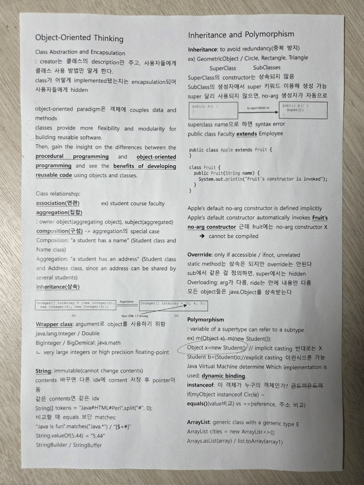
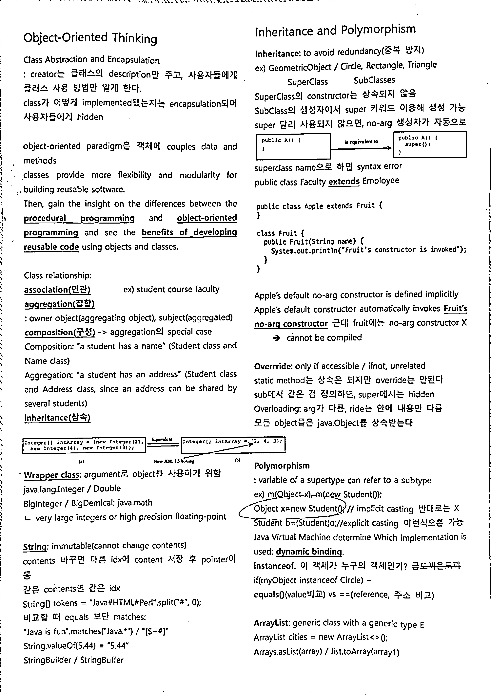

# Perspective Correction Tool

A simple GUI-based tool for correcting perspective distortion in document images. Click four corners of the document, and the tool will automatically rectify and binarize it for high-quality scanning results.

## Features

- Interactive corner selection with visual hints
- Perspective correction using homography
- Post-processing for clean, white-background document output
- Supports multiple paper sizes: A4, B4, A3, Letter, Legal

## Requirements

- Python 3.x  
- OpenCV (`opencv-python`)  
- Pillow (`Pillow`)  

Install dependencies:

```bash
pip install opencv-python Pillow
```

## Usage

1. Replace the `img_file` path in `config.py` with your input image path.
2. (Optional) Set the desired output paper size by modifying `SELECTED_SIZE` in `config.py`.  
   Available options are: `"A4"`, `"B4"`, `"A3"`, `"Letter"`, `"Legal"`
3. Run the application:

```bash
python main.py
```

3. In the window:
   - Left-click (`좌클릭`) 4 corners of the document in this order:  
     **Top-left → Top-right → Bottom-left → Bottom-right**
   - Right-click (`우클릭`) to undo a point.
4. Once 4 points are selected, the result is automatically saved to the path specified in `config.py` (`output_path`).

## Output

- The corrected and binarized image will be saved as a high-resolution document image based on the selected paper size and DPI.

## 🖼️ Example

### Input image:


### Output image:

